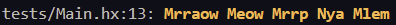

<br>

### Plasma

A type-safe, native Haxe library for terminals, providing a [Chalk](https://github.com/chalk/chalk)-like, easy-to-use, composable [ANSI](https://en.wikipedia.org/wiki/ANSI_escape_code) API, and additional cursor, screen, and buffer utilities. 
<br>

<br clear="left"/>

_**Known** Support Platforms: `hl`, `py`, `njs`, `js`, `cpp`, `cppia`, and `neko`_.

## Usage

```haxe
final plasma = new plasma.Plasma({level: TRUE_COLOR}); // Max Level

trace(plasma.yellow.bold.apply('Mrraow', 'Meow', 'Mrrp', 'Nya', 'Mlem'));
```


```haxe
final red:Plasma = new Plasma().hex(0xFF0000);
final bold:Plasma = new Plasma().bold;

trace((red + bold) + "CRITICAL MEOW DETECTED");
```


For additional usage examples, please refer to [/tests](./tests/)

## API

### plasma.`<style>[.<style>...].apply(string, [string...])`

e.g. `plasma.blue.bold.underline.apply("Hello,", "world!");`

Chain [styles](#styles) and call the last one as a method with a string argument. Order doesn't matter, and later styles take precedent in case of a conflict. This simply means that `plasma.red.yellow.green` is equivalent to `plasma.green`.

_Multiple arguments will be separated by space._

---

### Modifiers

| Primary Constant | Enum            | Aliases            |
| ---------------- | --------------- | ------------------ |
| `reset`          | `Reset`         | -                  |
| `bold`           | `Bold`          | `strong`           |
| `dim`            | `Dim`           | `faint`            |
| `italic`         | `Italic`        | -                  |
| `underline`      | `Underline`     | -                  |
| `overline`       | `Overline`      | -                  |
| `inverse`        | `Inverse`       | `invert` `reverse` |
| `hidden`         | `Hidden`        | `conceal`          |
| `strikethrough`  | `Strikethrough` | -                  |
| `visible`        | `Visible`       | -                  |

### Color Styles

| Base Hue            | Foreground      | Background        | Aliases         |
| ------------------- | --------------- | ----------------- | --------------- |
| **Base Variants**   |                 |                   |                 |
| Black               | `black`         | `bgBlack`         | -               |
| Red                 | `red`           | `bgRed`           | -               |
| Green               | `green`         | `bgGreen`         | -               |
| Yellow              | `yellow`        | `bgYellow`        | -               |
| Blue                | `blue`          | `bgBlue`          | -               |
| Magenta             | `magenta`       | `bgMagenta`       | `pink` `bgPink` |
| Cyan                | `cyan`          | `bgCyan`          | `aqua` `bgAqua` |
| White               | `white`         | `bgWhite`         | -               |
| **Bright Variants** |                 |                   |                 |
| Bright Black        | `blackBright`   | `bgBlackBright`   | `gray` `grey`   |
| Bright Red          | `redBright`     | `bgRedBright`     | -               |
| Bright Green        | `greenBright`   | `bgGreenBright`   | -               |
| Bright Yellow       | `yellowBright`  | `bgYellowBright`  | -               |
| Bright Blue         | `blueBright`    | `bgBlueBright`    | -               |
| Bright Magenta      | `magentaBright` | `bgMagentaBright` | `pinkBright`    |
| Bright Cyan         | `cyanBright`    | `bgCyanBright`    | `aquaBright`    |
| Bright White        | `whiteBright`   | `bgWhiteBright`   | -               |

_Since Chrome 69, ANSI escape codes are natively supported in the developer console._

---

## Utilities

| Category   | Method                      | Enum             | Description                                      |
| ---------- | --------------------------- | ---------------- | ------------------------------------------------ |
| **Cursor** | `Terminal.hideCursor()`     | `HideCursor`     | Hides the **Cursor**.                            |
| **Cursor** | `Terminal.showCursor()`     | `ShowCursor`     | Restores **Cursor** visibility.                  |
| **Cursor** | `Terminal.saveCursor()`     | `SaveCursor`     | Saves **Cursor** Position.                       |
| **Cursor** | `Terminal.restoreCursor()`  | `RestoreCursor`  | Restores the **Cursor** to it's saved position.  |
| **Screen** | `Terminal.clearScreen()`    | `ClearScreen`    | Clear everything from the active **buffer**.     |
| **Screen** | `Terminal.clearLine()`      | `ClearLine`      | Clear everything on the current **Cursor** line. |
| **Buffer** | `Terminal.enterAltBuffer()` | `EnterAltBuffer` | Enter the secondary alternate **Buffer**.        |
| **Buffer** | `Terminal.leaveAltBuffer()` | `LeaveAltBuffer` | Leave the alternate **Buffer**.                  |
| **System** | `Terminal.beep()`           | `Bell`           | Triggers an alert sound effect.                  |

---